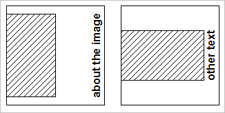

# Exemplo A{#example-a}

Crie um modelo de tamanho fixo com uma imagem de plano de fundo estática, uma imagem variável que é alinhada com o plano de fundo no centro esquerdo e dimensionada para não exceder 80% da largura e da altura do plano de fundo. E, finalmente, uma camada de texto com texto vertical centralizado na borda direita da tela.

## O registro do modelo {#section-32f54710593e438fa0622224c89380af}

Inserir objeto

<table id="simpletable_97ECA49445634F59B3F1D100412EFC70"> 
 <tr class="strow"> 
  <td class="stentry"> 
  catálogo::Id  
 </td> 
  <td class="stentry"> 
  myTemplate1  
 </td> 
 </tr> 
 <tr class="strow"> 
  <td class="stentry"> 
  catálogo::Modificador  
 </td> 
  <td class="stentry"> 
  src=backgroundImage&amp;size=1000,1000&amp;originN=0,0&amp; layer=1&amp;src=$object$&amp;size=800,800&amp;originN=-0,5,0&amp;posN=-0,5,0&amp; layer=2&amp;$text=layer+2+text+go+here&amp;text=rtf...$text$...rtf-encoding&amp;rotate=-90&amp;originN=0,5,0&amp;pos N=0,5,0  
 </td> 
 </tr> 
</table>

Os valores `origin=` de todas as camadas são especificados explicitamente no modelo para controlar estritamente o posicionamento e o alinhamento das camadas. Cada origem de camada é definida para corresponder ao alinhamento desejado para essa camada. O `origin=` para o plano de fundo (camada 0) está definido no centro; este valor é arbitrário porque a imagem do plano de fundo não muda em tempo de execução; qualquer valor para a origem da camada 0 pode ser usado.

Os valores de `pos=` fornecem os deslocamentos necessários entre os pontos de origem da camada para alcançar o posicionamento de camada desejado.

A âncora da imagem da camada 1 é colocada no centro esquerdo, com o valor `pos=`. Essa configuração obtém o alinhamento central à esquerda entre o plano de fundo e a imagem da camada 1, independentemente da proporção da imagem da camada 1.

Da mesma forma, a âncora da camada de texto é posicionada no centro direito da caixa de texto de dimensionamento automático, com o valor `pos=`. Essa configuração atinge o alinhamento desejado do centro direito para o texto girado, independentemente do tamanho da fonte e do comprimento da sequência.

O texto de exibição real é fornecido no tempo de execução, portanto, uma variável é usada para separar o texto do envelope de formatação rtf. A variável padrão `$object` é usada para a imagem da camada 1. Essa variável permite especificar essa imagem no caminho da solicitação.

Qualquer imagem pode ser usada para a imagem de fundo e a imagem da camada 1. Se a imagem de plano de fundo tiver uma máscara, as áreas não mascaradas serão preenchidas com a cor de plano de fundo padrão ( `attribute::BkgColor`) ou deixadas transparentes quando `fmt=png-alpha` ou `fmt=tif-alpha`. Se a imagem de fundo tiver uma proporção não quadrada, ela será centralizada na imagem de resposta e o espaço extra será preenchido com `attribute::BkgColor`. Se a imagem da camada 1 tiver dados alfa ou uma máscara, a imagem do plano de fundo (ou cor do plano de fundo) permanecerá visível nas áreas transparentes. Se a imagem não tiver máscara, ela preencherá todo o retângulo alocado.

## Utilização do template {#section-3e04eedc268c482db5a8cfc662c0f327}

` http:// *`servidor`*/myRootId/anotherImage?template=myTemplate1&$text=about+the+image`

A imagem a seguir mostra o resultado composto para diferentes taxas de proporção da imagem da camada 1 e diferentes cadeias de texto.

