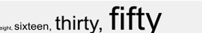
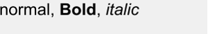
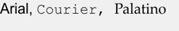
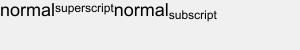
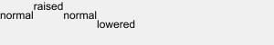
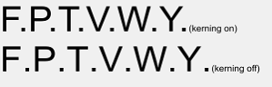
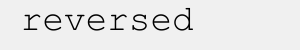

# Exemplos de codificação RTF{#rtf-encoding-examples}

Os exemplos a seguir mostram uma amostra de comandos de texto e como eles afetam o texto.

`http://server?fmt=png&size=300,50&bgc=f0f0f0&text=\fs16eight,%20\fs32sixteen,%20\fs60thirty,%20\fs100fifty`

`http://server?fmt=png&size=300,50&bgc=f0f0f0&text=\fs48normal,%20\b1Bold\b0,%20\i1italic\i0`

`http://server?fmt=png&size=300,50&bgc=f0f0f0&text={\fonttbl{\f0\fcharset0%20Arial;}{\f1\fcharset0%20Courier%20New;}{\f2\fcharset0%20Palatino%20Linotype;}}\f0\fs50%20Arial,%20\f1%20Courier,%20\f2%20Palatino`

`http://server?fmt=png&size=300,50&bgc=f0f0f0&text={\colortbl%20;\red255\green0\blue0;\red0\green128\blue0;\red0\green0\blue255;}\fs48\cf1red,%20\cf2green,%20\cf3blue`

`http://server?fmt=png&size=300,50&bgc=f0f0f0&text=top-left&layer=1&sizen=1,1&text=\vertalc\qc%20center&layer=2&sizen=1,1&text=\vertalb\qr%20bottom -right`

`http://server?fmt=png&size=300,50&bgc=f0f0f0&text=\fs36normal{\super%20superscript}normal{\sub%20subscript}`

`http://server?fmt=png&size=300,50&bgc=f0f0f0&text=normal{\up20raised}normal{\dn20lowered}`

`http://server?fmt=png&size=300,100&bgc=f0f0f0&text=\fs80F.P.T.V.W.Y.{\fs20(kerning%20on)}\line{\kerning0F.P.T.V.W.Y.}{\fs20(kerning%20off)}`

`http://server?fmt=png&size=300,50&bgc=f0f0f0&text={\fonttbl{\f0\fmodern\fprq1\fcharset0%20Courier%20New;}}\f0\fs72{\rtlch%20desrever}`

## Consulte Também {#section-e702276fd0e847779cb75a6ccb92fbc8}

[texto=](../../../../../is-api/http-ref/image-serving-api-ref/c-http-protocol-reference/c-command-reference/r-text.md#reference-84634052e48548539a1ef63cbe41f22f) , [textPs=](../../../../../is-api/http-ref/image-serving-api-ref/c-http-protocol-reference/c-command-reference/r-textps.md#reference-4209a2a6169f44278da2647cfb0cd767), [textAttr=](../../../../../is-api/http-ref/image-serving-api-ref/c-http-protocol-reference/c-command-reference/r-textattr.md#reference-ff00484fa3244286abeff34911f7ec0d), [Codificação HTTP](../../../../../is-api/http-ref/image-serving-api-ref/c-http-protocol-reference/c-syntax-and-features/r-http-encoding.md#reference-bb34dd13f316462695448acfa8f92df7)

<!-- OBSOLETE LINK WITH NO SUITABLE REPLACEMENT , [RTF 1.9.1 Specification](https://interoperability.blob.core.windows.net/files/Archive_References/%5bMSFT-RTF%5d.pdf) -->

