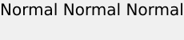

# Posicionamento de texto{#text-positioning}

O renderizador text= posiciona o texto fundamentalmente diferente do renderizador textPs= quando aplicado a camadas pré-dimensionadas (ou seja, quando size= também é especificado).

As camadas de dimensionamento automático `text=`e `textPs=` têm aparência e posicionamento semelhantes.

`textPs=` Alinha a parte superior da célula de caracteres com a parte superior da caixa de texto (supondo  `\vertalt`), mesmo que isso resulte em partes dos glifos de texto renderizados que estendem parcialmente para fora do limite da caixa de texto. Os glifos renderizados de determinadas fontes também podem se projetar ligeiramente para além das bordas esquerda e direita da caixa de texto. Para aplicativos que exigem que todo o texto renderizado esteja contido no retângulo da camada, os comandos RTF `\marg*` ou `textFlowPath=` podem ser usados para ajustar a área de renderização do texto.

Por outro lado, `text=` alterará o texto renderizado conforme necessário e garantirá que todos os glifos renderizados se encaixem completamente na caixa de texto especificada.

Embora `text=` possa ser um pouco mais fácil de usar para aplicativos simples, `textPs=` oferece posicionamento preciso independentemente de faces de fonte e efeitos de texto.

## Exemplos {#section-1b6bdf2ea34447528188ae4e1430ee71}

Os exemplos a seguir são para texto pré-dimensionado. O comportamento do texto de autodimensionamento é diferente.

** `Text=` sempre fornece uma margem estreita na parte superior:**

`/is/image/?size=230,50&bgc=f0f0f0&fmt=png&text=\fs40Normal%20Normal%20Normal`

** `textPs=` renderiza o texto fortemente alinhado à parte superior da caixa de texto, o que pode resultar em pequenos recortes, mesmo para fontes comuns, como Arial:**

`/is/image/?size=230,50&bgc=f0f0f0&fmt=png&textPs=\fs40Normal%20Normal%20Normal`

** `text=` alterará automaticamente o texto renderizado para baixo para evitar o recorte:**

`/is/image?size=230,50&bgc=f0f0f0&fmt=png&text=\fs40Normal%20{\up20Raised%20}Normal`

** `textPs=` não moverá o texto contendo as partes levantadas, resultando em recorte significativo se o texto estiver na camada 0:**

`/is/image?size=230,50&bgc=f0f0f0&fmt=png&textPs=\fs40Normal%20{\up20Raised%20}Normal`

**Uma margem de 10 pt (200 pontos) na parte superior renderiza esse texto sem recorte:**

`/is/image?size=230,50&bgc=f0f0f0&fmt=png&textPs=\margt200\fs40Normal%20{\up20Raised}%20Normal`

**Glifos renderizados de determinadas fontes de script podem se estender significativamente fora da caixa de texto:**

`/is/image?size=230,50&bgc=f0f0f0&fmt=png&textPs={\fonttbl{\f1\fcharset0%20FluffyFont;}}\f1\fs88%20fluffy%20font%20problems`
