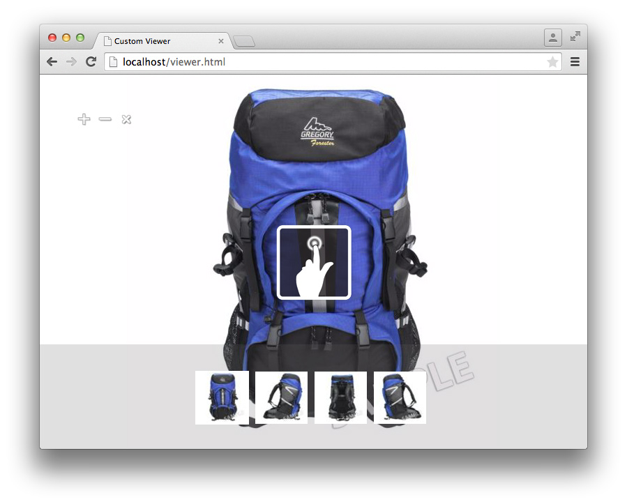

# Tutorial do SDK do visualizador{#viewer-sdk-tutorial}

O SDK do visualizador fornece um conjunto de componentes baseados em JavaScript para o desenvolvimento personalizado do visualizador. Os visualizadores são aplicativos baseados na Web que permitem que o conteúdo de mídia avançada servido pelo Adobe Dynamic Media seja incorporado em páginas da Web.

Por exemplo, o SDK fornece zoom interativo e panorâmica. Ele também fornece visualização de 360° e reprodução de vídeo de ativos que foram carregados no Adobe Dynamic Media por meio do aplicativo de back-end chamado Dynamic Media Classic.

Embora os componentes dependam da funcionalidade HTML5, eles foram projetados para funcionar em dispositivos e desktops Android e Apple iOS, incluindo o Internet Explorer e posterior. Esse tipo de experiência significa que você pode fornecer um único fluxo de trabalho para todas as plataformas compatíveis.

O SDK consiste em Componentes da interface do usuário que compõem o conteúdo do visualizador. Você pode criar estilos para esses componentes por meio de CSS e componentes que não sejam de interface do usuário que têm algum tipo de função de suporte, como buscar e analisar ou rastrear a definição do conjunto. Todos os comportamentos de componente são personalizáveis por meio de modificadores que podem ser especificados de várias maneiras, por exemplo, como pares `name=value` no URL.

Este tutorial inclui a seguinte ordem de tarefas para ajudar você a criar um visualizador básico de zoom:

* [Baixar o SDK do visualizador mais recente do Adobe Developer Connection](c-tutorial.md#section-84dc74c9d8e24a2380b6cf8fc28d7127)
* [Carregar o SDK do visualizador](c-tutorial.md#section-98596c276faf4cf79ccf558a9f4432c6)
* [Adicionar estilo ao visualizador](c-tutorial.md#section-3783125360a1425eae5a5a334867cc32)
* [Inclusão de Contêiner e ZoomView](c-tutorial.md#section-1a01730663154a508b88cc40c6f35539)
* [Adicionar componentes MediaSet e Swatches ao visualizador](c-tutorial.md#section-02b8c21dd842400e83eae2a48ec265b7)
* [Adição de botões ao visualizador](c-tutorial.md#section-1fc334fa0d2b47eb9cdad461725c07be)
* [Configuração vertical das amostras](c-tutorial.md#section-91a8829d5b5a4d45a35b7faeb097fcc9)

## Baixe o SDK do visualizador mais recente do Adobe Developer Connection {#section-84dc74c9d8e24a2380b6cf8fc28d7127}

1. Baixe o SDK do visualizador mais recente do Adobe Developer Connection [aqui](https://marketing.adobe.com/developer/devcenter/scene7/show).

   >[!NOTE]
   >
   >Você pode concluir este tutorial sem a necessidade de baixar o pacote do SDK do visualizador porque o SDK é realmente carregado remotamente. No entanto, o pacote Visualizador inclui exemplos adicionais e um guia de referência de API que você achará útil ao criar seus próprios visualizadores.

## Carregar o SDK do visualizador {#section-98596c276faf4cf79ccf558a9f4432c6}

1. Comece configurando uma nova página para desenvolver o visualizador básico de zoom que você criará.

   Considere isso o código de inicialização - ou carregador - para configurar um aplicativo SDK vazio. Abra o editor de texto favorito e cole a seguinte marcação HTML nele:

   ```
   <!DOCTYPE html> 
   <html> 
       <head> 
           <meta http-equiv="Content-Type" content="text/html; charset=utf-8" /> 
           <meta name="viewport" content="user-scalable=no, height=device-height, width=device-width, initial-scale=1.0, maximum-scale=1.0"/> 
   
           <!-- Hiding the Safari on iPhone OS UI components --> 
           <meta name="apple-mobile-web-app-capable" content="yes"/> 
           <meta name="apple-mobile-web-app-status-bar-style" content="black"/> 
           <meta name="apple-touch-fullscreen" content="no"/> 
   
           <title>Custom Viewer</title> 
   
           <!-- 
               Include Utils.js before you use any of the SDK components. This file  
               contains SDK utilities and global functions that are used to initialize the viewer and load viewer  
               components. The path to the Utils.js determines which version of the SDK that the viewer uses. You  
               can use a relative path if the viewer is deployed on one of the Adobe Dynamic Media servers and it is served  
               from the same domain. Otherwise, specify a full path to one of Adobe Dynamic Media servers that have the SDK  
               installed.  
           --> 
           <script language="javascript" type="text/javascript"      
                   src="http://s7d1.scene7.com/s7sdk/2.8/js/s7sdk/utils/Utils.js"></script> 
   
       </head> 
       <body> 
           <script language="javascript" type="text/javascript"> 
           </script>  
       </body> 
   </html>
   ```

   Adicione o seguinte código JavaScript dentro da tag `script` para inicializar o `ParameterManager`. Isso ajuda você a se preparar para criar e instanciar componentes do SDK dentro da função `initViewer`:

   ```
   /* We create a self-running anonymous function to encapsulate variable scope. Placing code inside such 
      a function is optional, but this prevents variables from polluting the global object.  */ 
   (function () { 
   
       // Initialize the SDK   
       s7sdk.Util.init(); 
   
       /* Create an instance of the ParameterManager component to collect components' configuration 
          that can come from a viewer preset, URL, or the HTML page itself. The ParameterManager  
          component also sends a notification s7sdk.Event.SDK_READY when all needed files are loaded 
          and the configuration parameters are processed. The other components should never be initialized 
          outside this handler. After defining the handler for the s7sdk.Event.SDK_READY event, it 
          is safe to initiate configuration initialization by calling ParameterManager.init(). */ 
       var params = new s7sdk.ParameterManager(); 
   
       /* Event handler for s7sdk.Event.SDK_READY dispatched by ParameterManager to initialize various components of  
          this viewer. */ 
       function initViewer() { 
   
       }  
   
       /* Add event handler for the s7sdk.Event.SDK_READY event dispatched by the ParameterManager when all modifiers 
          are processed and it is safe to initialize the viewer. */ 
       params.addEventListener(s7sdk.Event.SDK_READY, initViewer, false); 
   
       /* Initiate configuration initialization of ParameterManager. */ 
       params.init(); 
   
   }());
   ```

1. Salve o arquivo como um template vazio. Você pode usar qualquer nome de arquivo desejado.

   Você usará esse arquivo de modelo vazio como referência ao criar novos visualizadores no futuro. Este modelo funciona localmente e quando é disponibilizado de um servidor da Web.

Agora, você adicionará estilo ao seu visualizador.

## Adicionar estilo ao visualizador {#section-3783125360a1425eae5a5a334867cc32}

1. Para esse visualizador de página completo que você está criando, é possível adicionar estilos básicos.

   Adicione o seguinte bloco `style` à parte inferior de `head`:

   ```
   <style> 
       html, body { 
           width: 100%; 
           height: 100%; 
       } 
       body { 
           /* Remove any padding and margin around the edges of the browser window */ 
           padding: 0; 
           margin: 0; 
   
           /* We set overflow to hidden so that scroll bars do not flicker when resizing the window */ 
           overflow: hidden; 
       } 
   </style>
   ```

Agora você incluirá os componentes `Container` e `ZoomView`.

## Incluindo Contêiner e ZoomView {#section-1a01730663154a508b88cc40c6f35539}

1. Crie um visualizador real incluindo os componentes `Container` e `ZoomView`.

   Insira as seguintes instruções `include` na parte inferior do elemento `<head>`, depois que o script [!DNL Utils.js] for carregado:

   ```
   <!-- 
       Add an "include" statement with a related module for each component that is needed for that particular  
       viewer. Check API documentation to see a complete list of components and their modules. 
   --> 
   <script language="javascript" type="text/javascript"> 
       s7sdk.Util.lib.include('s7sdk.common.Container');  
       s7sdk.Util.lib.include('s7sdk.image.ZoomView');  
   </script>
   ```

1. Agora, crie variáveis para fazer referência aos vários componentes do SDK.

   Adicione as seguintes variáveis à parte superior da função anônima principal, logo acima de `s7sdk.Util.init()`:

   ```
   var container, zoomView;
   ```

1. Insira o seguinte dentro da função `initViewer` para definir alguns modificadores e instanciar os respectivos componentes:

   ```
   /* Modifiers can be added directly to ParameterManager instance */ 
   params.push("serverurl", "http://s7d1.scene7.com/is/image"); 
   params.push("asset", "Scene7SharedAssets/ImageSet-Views-Sample"); 
   
   /* Create a viewer container as a parent component for other user interface components that  
      are part of the viewer application and associate event handlers for resize and  
      full screen notification. The advantage of using Container as the parent is the  
      component's ability to resize and bring itself and its children to full screen. */ 
   container = new s7sdk.common.Container(null, params, "s7container"); 
   container.addEventListener(s7sdk.event.ResizeEvent.COMPONENT_RESIZE, containerResize, false); 
   
   /* Create ZoomView component */ 
   zoomView = new s7sdk.image.ZoomView("s7container", params, "myZoomView");  
   
   /* We call this to ensure all SDK components are scaled to initial conditions when viewer loads */ 
   resizeViewer(container.getWidth(), container.getHeight());
   ```

1. Para que o código acima seja executado corretamente, adicione um manipulador de evento `containerResize` e uma função auxiliar:

   ```
   /* Event handler for s7sdk.event.ResizeEvent.COMPONENT_RESIZE events dispatched by Container to resize 
      various view components included in this viewer. */ 
   function containerResize(event) { 
       resizeViewer(event.s7event.w, event.s7event.h); 
   } 
   
   /* Resize viewer components */ 
   function resizeViewer(width, height) { 
       zoomView.resize(width, height); 
   }
   ```

1. Visualize a página para visualizar o que você criou. A página terá a seguinte aparência:

   

Agora, você adicionará os componentes `MediaSet` e `Swatches` ao seu visualizador.

## Adicionar componentes MediaSet e Amostras ao seu visualizador {#section-02b8c21dd842400e83eae2a48ec265b7}

1. Para dar aos usuários a capacidade de selecionar imagens de um conjunto, você pode adicionar os componentes `MediaSet` e `Swatches`.

   Adicione o seguinte SDK inclui:

   ```
   s7sdk.Util.lib.include('s7sdk.set.MediaSet'); 
   s7sdk.Util.lib.include('s7sdk.set.Swatches');
   ```

1. Atualize a lista de variáveis com o seguinte:

   ```
   var mediaSet, container, zoomView, swatches;
   ```

1. Instancie os componentes `MediaSet` e `Swatches` dentro da função `initViewer`.

   Certifique-se de instanciar a instância `Swatches` após os componentes `ZoomView` e `Container`; caso contrário, a ordem de empilhamento oculta `Swatches`:

   ```
   // Create MediaSet to manage assets and add event listener to the NOTF_SET_PARSED event 
   mediaSet = new s7sdk.set.MediaSet(null, params, "mediaSet"); 
   
   // Add MediaSet event listener 
   mediaSet.addEventListener(s7sdk.event.AssetEvent.NOTF_SET_PARSED, onSetParsed, false); 
   
   /* create Swatches component and associate event handler for swatch selection notification */ 
   swatches = new s7sdk.set.Swatches("s7container", params, "mySwatches");   
   swatches.addEventListener(s7sdk.event.AssetEvent.SWATCH_SELECTED_EVENT, swatchSelected, false);
   ```

1. Agora, adicione as seguintes funções de manipulador de eventos:

   ```
   /* Event handler for the s7sdk.event.AssetEvent.NOTF_SET_PARSED event dispatched by MediaSet to 
      assign the asset to the Swatches when parsing is complete. */ 
   function onSetParsed(e) { 
   
       // set media set for Swatches to display  
       var mediasetDesc = e.s7event.asset;  
       swatches.setMediaSet(mediasetDesc); 
   
       // select the first swatch by default  
       swatches.selectSwatch(0, true);      
   } 
   
   /* Event handler for s7sdk.event.AssetEvent.SWATCH_SELECTED_EVENT events dispatched by Swatches to switch 
      the image in the ZoomView when a different swatch is selected. */ 
   function swatchSelected(event) {     
       zoomView.setItem(event.s7event.asset);  
   }
   ```

1. Posicione as amostras na parte inferior do visualizador, adicionando o seguinte CSS ao elemento `style`:

   ```
   /* Align swatches to bottom of viewer */ 
   .s7swatches { 
       bottom: 0; 
       left: 0; 
       right: 0; 
       height: 150px; 
   }
   ```

1. Visualize seu visualizador.

   Observe que as amostras estão no canto inferior esquerdo do visualizador. Para ter as amostras para obter toda a largura do visualizador, adicione uma chamada para redimensionar manualmente as amostras sempre que o usuário redimensionar o navegador. Adicione o seguinte à função `resizeViewer` :

   ```
   swatches.resize(width, swatches.getHeight());
   ```

   Seu visualizador agora se parece com a seguinte imagem. Tente redimensionar a janela do navegador do visualizador e observe o comportamento resultante.

   

Agora, você adicionará botões de zoom, zoom e zoom de redefinição ao visualizador.

## Adição de botões ao visualizador {#section-1fc334fa0d2b47eb9cdad461725c07be}

1. Atualmente, o usuário só pode aplicar zoom usando gestos de clique ou toque. Portanto, adicione alguns botões básicos de controle de zoom ao visualizador.

   Adicione os seguintes componentes de botão:

   ```
   s7sdk.Util.lib.include('s7sdk.common.Button');
   ```

1. Atualize a lista de variáveis com o seguinte:

   ```
   var mediaSet, container, zoomView, swatches, zoomInButton, zoomOutButton, zoomResetButton;
   ```

1. Instanciar botões na parte inferior da função `initViewer`.

   Lembre-se de que a ordem é importante, a menos que você especifique o `z-index` em CSS:

   ```
   /* Create Zoom In, Zoom Out and Zoom Reset buttons */ 
   zoomInButton  = new s7sdk.common.ZoomInButton("s7container", params, "zoomInBtn"); 
   zoomOutButton = new s7sdk.common.ZoomOutButton("s7container", params, "zoomOutBtn"); 
   zoomResetButton = new s7sdk.common.ZoomResetButton("s7container", params, "zoomResetBtn"); 
   
   /* Add handlers for zoom in, zoom out and zoom reset buttons inline. */ 
   zoomInButton.addEventListener("click", function() { zoomView.zoomIn(); }); 
   zoomOutButton.addEventListener("click", function() { zoomView.zoomOut(); }); 
   zoomResetButton.addEventListener("click", function() { zoomView.zoomReset(); });
   ```

1. Agora defina alguns estilos básicos para os botões, adicionando o seguinte ao bloco `style` na parte superior do arquivo:

   ```
   /* define styles common to all button components and their sub-classes */ 
   .s7button { 
       position:absolute; 
       width: 28px; 
       height: 28px; 
       z-index:100; 
   } 
   
   /* position individual buttons*/ 
   .s7zoominbutton  { 
       top: 50px; 
       left: 50px; 
    } 
   .s7zoomoutbutton  { 
       top: 50px; 
       left: 80px; 
    } 
   .s7zoomresetbutton  { 
       top: 50px; 
       left: 110px; 
    }
   ```

1. Visualize seu visualizador. Será semelhante ao seguinte:

   

   Agora você configurará as Amostras para que elas estejam alinhadas verticalmente à direita.

## Configurar as amostras verticalmente {#section-91a8829d5b5a4d45a35b7faeb097fcc9}

1. Você pode configurar modificadores diretamente na instância `ParameterManager`.

   Adicione o seguinte à parte superior da função `initViewer` para configurar o layout de miniatura `Swatches` como uma única linha:

   ```
   params.push("Swatches.tmblayout", "1,0");
   ```

1. Atualize a seguinte chamada de redimensionamento dentro de `resizeViewer`:

   ```
   swatches.resize(swatches.getWidth(), height);
   ```

1. Edite a seguinte regra `s7swatches` em `ZoomViewer.css`:

   ```
   .s7swatches { 
       top:0 ; 
       bottom: 0; 
       right: 0; 
       width: 150px; 
   }
   ```

1. Visualize seu visualizador. Será semelhante ao seguinte:

   

   Seu visualizador básico de zoom foi concluído.

   Este tutorial do visualizador toca nos fundamentos do que o SDK do visualizador do Dynamic Media oferece. À medida que você trabalha com o SDK, pode usar os vários componentes padrão para criar e criar experiências de visualização avançadas com estilo facilmente para seus públicos-alvo.

